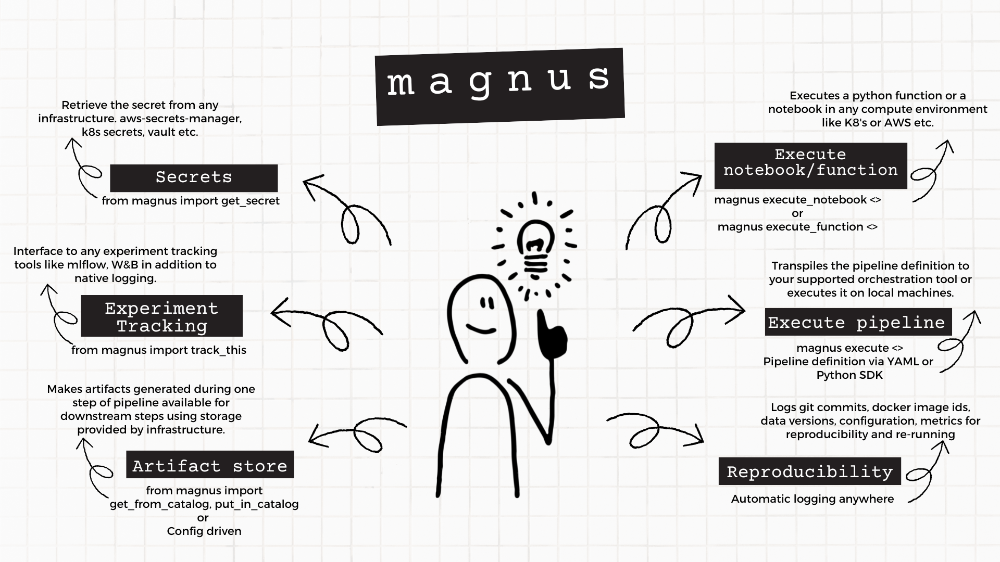

# Welcome to Magnus Extensions

This repository provides all the extensions to [magnus core package](https://github.com/AstraZeneca/magnus-core).

Magnus provides 5 essential services:

- Executor: A way to define and execute/transpile dag definition.
- Catalog: An artifact store used to log and store data files generated during a pipeline execution.
- Secrets Handler: A framework to handle secrets from different providers.
- Logging: A comprehensive and automatic logging framework to capture essential information of a pipeline execution.
- Experiment Tracking: A framework to interact with different experiment tracking tools.

## A schematic to show what it does

{ style="display: block; margin: 0 auto" }

## Available extensions to the services:

| Service     | Description                          |   Availability   |
| :---------: | :----------------------------------: |  :-------------: |
| **Executors**   |                                      |                  |
| Local       | Run the pipeline on local machine (default) |   Part of Magnus core |
| Local Containers    | Run the pipeline on local containers | Part of Magnus core |
| Kubeflow    | Transpile using Kubeflow pipelines | Part of extensions |
| Argo Workflows    | Transpile to Argo Workflow specification | Part of extensions |
| K8s Job    | Executes notebooks/functions in Kubernetes | Part of extensions |
| **Catalog**     |                                      |                  |
| Do Nothing  | Provides no cataloging functionality |   Part of Magnus core |
| File System  | Uses local file system (default) |   Part of Magnus core |
| S3 | Uses S3 as a catalog | Part of extensions |
| K8s PVB | Uses Persistent volumes in K8s as a catalog | Part of extensions |
| **Secrets**     |                                      |                  |
| Do Nothing  | Provides no secrets handler (default) |   Part of Magnus core |
| Dot Env  | Uses a file as secrets  |   Part of Magnus core |
| Environment Variables  | Gets secrets from Environmental variables  |   Part of Magnus core |
| **Logging**     |                                      |                  |
|   Buffered  | Uses the run time buffer as logger (default) |   Part of Magnus core |
| File System  | Uses a file system as run log store  |   Part of Magnus core |
| Chunked File System | Uses a file system but thread safe | Part of magnus core |
| S3 | Uses S3 to store logs | Part of extensions |
| Chunked S3 | Uses S3 to store logs but thread safe | Part of extensions |
| K8s PVC | Uses persistent volumes of K8s as run log store | Part of extensions |
| K8s PVC Chunked | Uses persistent volumes of K8s as run log store but thread safe | Part of extensions |
| **Experiment Tracking**     |                                      |                  |
|   Do Nothing  | Provides no experiment tracking (default) |   Part of Magnus core |
|   ML Flow  | Provides MLFlow experiment tracking |   Part of extensions |
